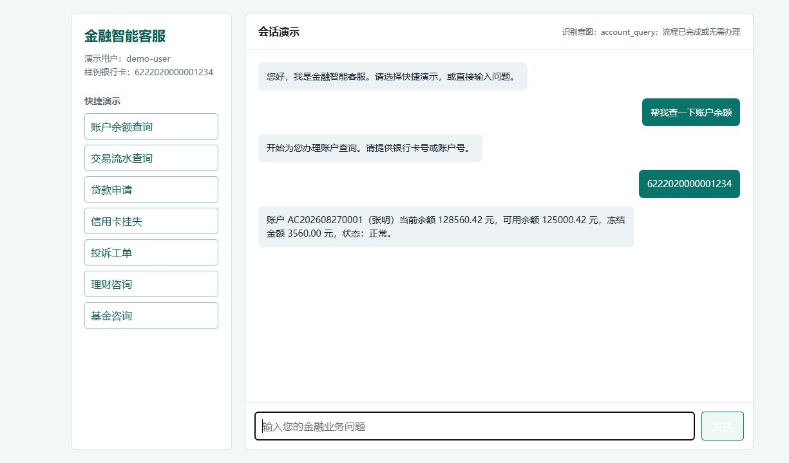
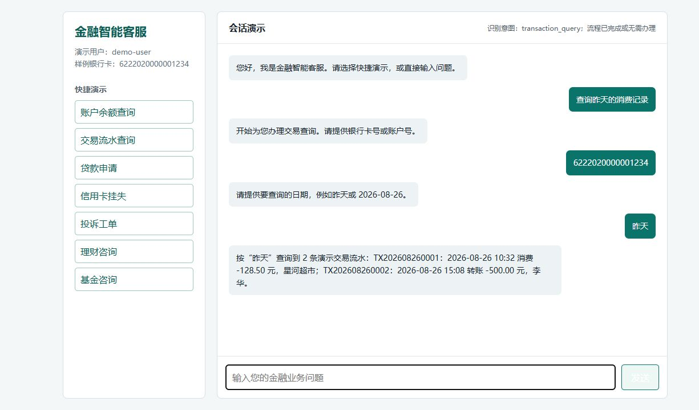
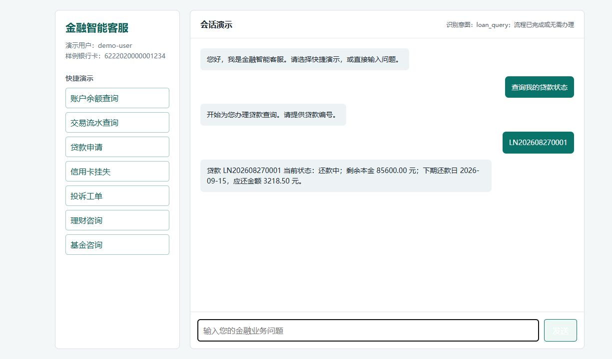
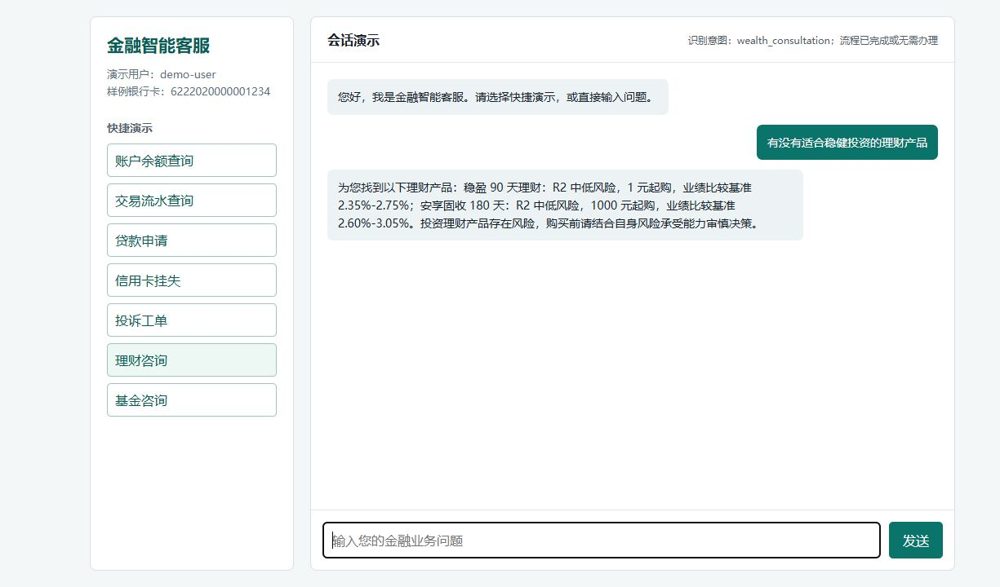
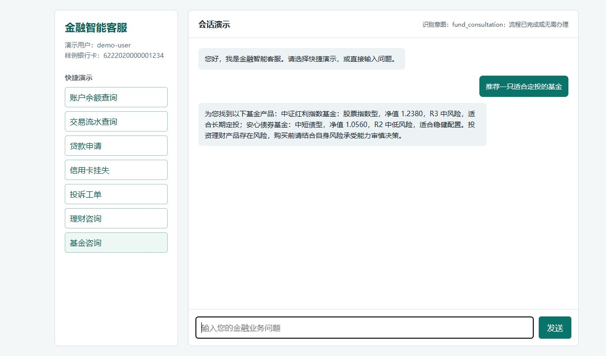
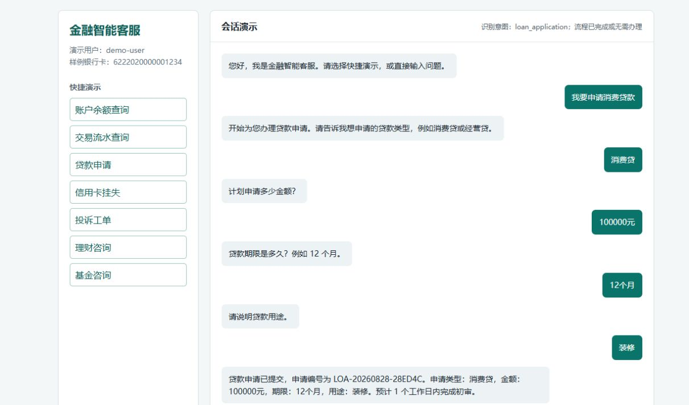
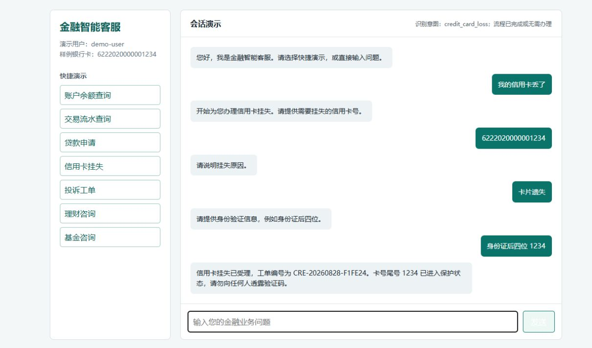
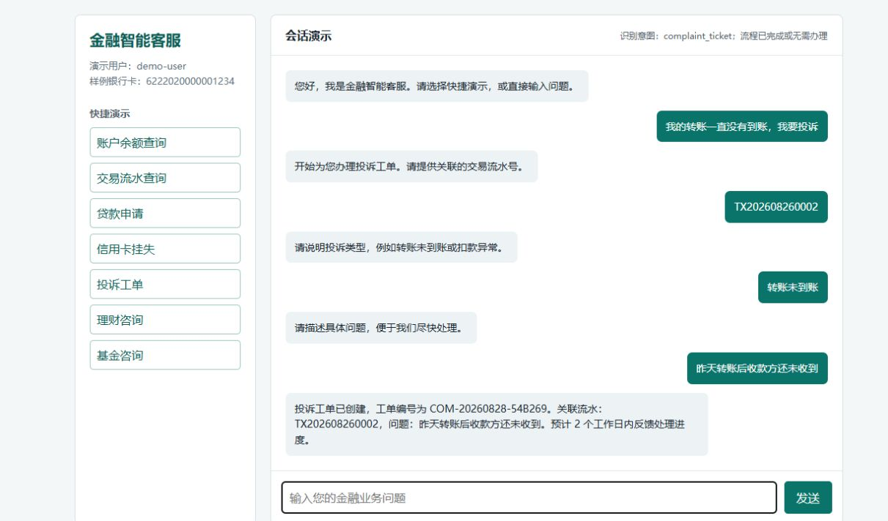
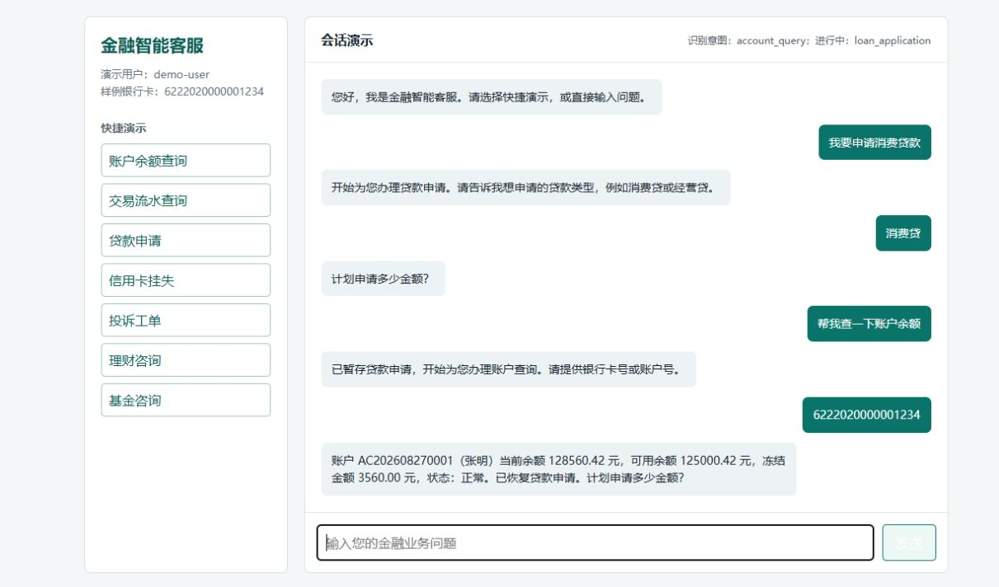

# 金融智能客服前端调试/演示页面

本页截图均来自演示服务 `http://192.168.200.128:18083` 的真实对话结果，图片路径相对于本文件为 `images/`。页面中的余额、流水、贷款、理财和基金内容读取自 `customer-service-backend/finance_sample_data.json`，申请/挂失/投诉编号由接口实时生成。

## 1. 账户余额查询（真实数据）

输入样例银行卡号 `6222020000001234` 后，页面显示账户号、客户姓名、当前余额、可用余额、冻结金额和账户状态。

## 2. 交易流水查询（真实数据）

输入银行卡号和日期“昨天”后，页面返回两条演示流水，包含交易流水号、时间、类型、金额和交易对手方。

## 3. 贷款状态查询（真实数据）

输入贷款编号 `LN202608270001` 后，页面显示贷款状态、剩余本金、下期还款日和应还金额。

## 4. 理财产品查询（真实数据）

页面返回样例理财产品的期限、风险等级、起购金额和业绩比较基准，并附风险提示。

## 5. 基金产品查询（真实数据）

页面返回基金类型、最新净值、风险等级及适合长期定投/稳健配置的说明。

## 6. 贷款申请闭环

通过贷款类型、金额、期限和用途四轮对话完成申请，页面显示实时生成的申请编号和流程状态。

## 7. 信用卡挂失闭环

通过信用卡号、挂失原因和身份验证信息完成挂失受理，页面显示工单编号、卡号尾号及保护状态。

## 8. 投诉工单闭环

输入交易流水号、投诉类型和问题描述后，页面显示投诉工单编号、关联流水及预计反馈时间。

## 9. 会话恢复与状态持久化

先暂存贷款申请，再查询账户余额；账户查询完成后页面自动恢复贷款申请，并继续提示缺少的金额槽位，验证多轮状态持久化。

> 说明：截图中的编号（申请编号、挂失工单号、投诉工单号）由每次演示实时生成，因此不同运行时可能不同。
