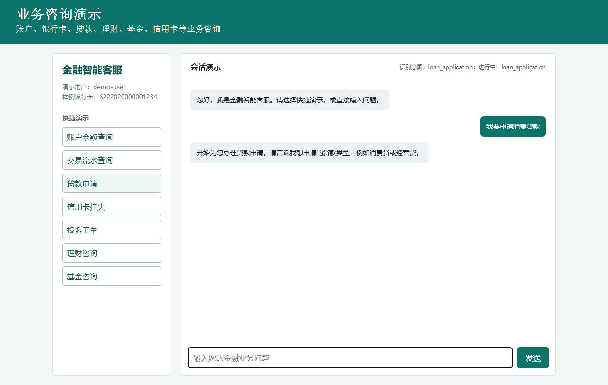
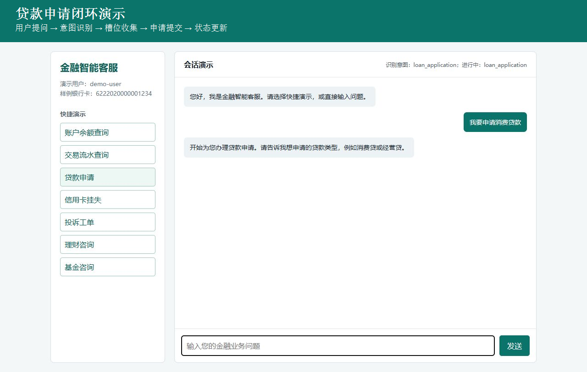
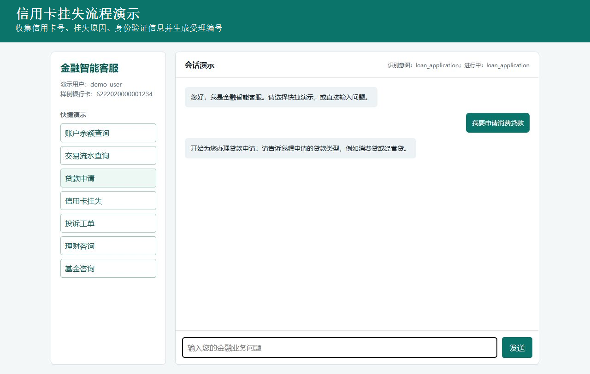

# 金融智能客服前端调试/演示页面

本交付物展示金融智能客服前端的会话页面、快捷业务入口、意图识别结果、当前任务状态和多轮对话区域。以下图片均使用相对于本文件的 `images/` 路径。

## 1. 金融业务咨询

支持账户、银行卡、贷款、理财、基金、信用卡等业务咨询，并在页面中展示客服回复。

## 2. 多轮槽位收集

在连续对话中收集和保留客户身份、银行卡号、交易流水号、贷款编号等业务槽位信息。

## 3. 贷款申请闭环

完成“用户提问 → 意图识别 → 收集贷款类型、金额、期限、用途 → 生成申请编号 → 状态更新”的完整流程。

## 4. 信用卡挂失

引导收集信用卡号、挂失原因与身份验证信息，完成挂失受理并返回业务编号。

## 5. 投诉工单

引导收集关联交易流水号、投诉类型与问题描述，创建投诉工单并返回工单编号。

## 6. 会话恢复与状态持久化

流程切换时持久化当前任务与已收集槽位；完成临时查询后，系统可恢复此前正在办理的业务。

演示服务地址：`http://127.0.0.1:18083`
